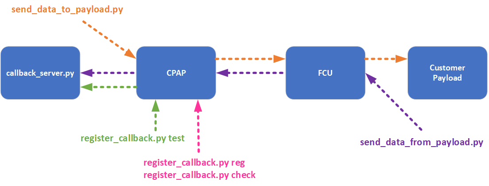

# Test Scripts for the Customer Payload Software Interface Control (SWIC)



## Setup Runtime Environment

```shell
$ pip install pipenv
$ pipenv install
$ pipenv shell
```

## Generate a JWT

1. `jwt-payload.json` = JSON file containing the JWT payload (copy from `jwt-template.json`).

    * `<NAME>`:
    * `<CUSTOMER>`: Arbitrary string to identify the customer. This value is concantenated with
        the `<MISSION_ID>` to form the CPAP `<UID>` that uniquely identifies the callback endpoint
        which means that multiple callback endpoints can be registered for the same `<MISSION_ID>`
        if they are registered with different `<CUSTOMER>` values.
    * `<MISSION_ID>`: Mission ID to filter message for (must be specified in decimal).
    * `<FLIGHT_ID>`: Flight ID to filter messages for (must be specified in decimal). Multiple
        flights can be specified in one JWT.
    * `<PAYLOAD_NUM>`: Specifies which payloads to receive callbacks for. [1-5]
    * `<PAYLOAD_NAME>`: Arbitrary string to label the payload.

    Template:
    ```json
    {
        "name": "<NAME>",
        "cust": "<CUSTOMER>",
        "mission": "<MISSION_ID>",
        "flights": {
            "<FLIGHT_ID>": {
                "<PAYLOAD_NUM>": "<PAYLOAD_NAME>",
                "<PAYLOAD_NUM>": "<PAYLOAD_NAME>"
            }
        }
    }
    ```

    Example:
    ```json
    {
        "name": "CPAP Test",
        "cust": "cpaptest",
        "mission": "56026",
        "flights": {
            "123": {
                "1": "GPS",
                "2": "Camera"
            },
            "456": {
                "1": "Lidar",
            }
        }
    }
    ```

2. `jwt-secret.json` = JSON file containing a secret for signing the JWT.
    The secret must match the one that CPAP is configured to use.

    ```json
    {
        "secretKey": "SECRET GOES HERE"
    }
    ```

3. Generate the JWT

    ```shell
    $ python generate_jwt.py -o jwt.txt jwt-payload.json jtw-secret.json
    ```

## Start the Test Callback Server

```shell
$ python callback_server.py
```

* The callback server listens on all interfaces at port 5000.
* Browse to `http://localhost:5000/callback` to check if callback server is running.
* The callback endpoint is `http://<callback-host>:5000/callback`
* `<callback-host>` = Hostname or IP of the callback server.

## Register Callback Server with CPAP

* `jwt.txt` = Text file containing the JWT to authenticate with.
* `<cpap-host>` = Hostname of the CPAP server.
* `<callback-host>` = Hostname of the callback server.

1. Register the callback endpoint with CPAP:

    ```shell
    $ python register_callback.py reg https://<cpap-host>/api/ http://<callback-host>:5000/callback
    ```

2. Test that CPAP can call the callback.

    ```shell
    $ python register_callback.py test https://<cpap-host>/api/
    ```

3. Check that the registration was successful.

    ```shell
    $ python register_callback.py check https://<cpap-host>/api/
    ```

## Send Data from the Ground to the Payload

* `jwt.txt` = Text file containing the JWT to authenticate with.
* `data.txt` = The data to send. It's just passed-through so it doesn't really matter what it contains.
* `<cpap-host>` = Hostname of the CPAP server.

    ```shell
    $ python send_data_to_payload.py https://<cpap-host>/api/
    ```

### To see if it worked:

* In theory you could ssh to the fcu and tail /opt/vista/log/flightcontrol.log but
  I wasn't setup to try it so I don't know what you would grep for.
* I validated by watching flightcontroller and/or sirs-monitor logs in Kibana.

```
    February 26th 2019, 11:06:23.373	sirs-monitor	Feb 26 17:06:23.372 <--   1 M: DADA Src: 0018/08 Dst: 0133/08 Via: 02 Len:  68 Type: User Subtype: Payload
    February 26th 2019, 11:06:22.443	sirs-monitor	Feb 26 17:06:22.441     --> M: DADA Src: 0018/08 Dst: 0133/08 Via: 02 Len:  68 Type: User Subtype: Payload
    February 26th 2019, 11:06:22.285	flightcontroller	    Buffer=[This is test data to send to a payload.]
    February 26th 2019, 11:06:22.285	flightcontroller	  Payload Message:
    February 26th 2019, 11:06:22.285	flightcontroller	    Payload ID        : 1
    February 26th 2019, 11:06:22.282	flightcontroller	Received a Payload Message: id=1, sent=1551200782.282625, recv=0.000000, dt=-1551200782.282625, data size=39 bytes
    February 26th 2019, 11:06:22.282	flightcontroller	Payload id 1 with message Base64 encode size = 52, decoded size = 39
    February 26th 2019, 11:06:22.282	flightcontroller	Payload setBuffer called with size 39
    February 26th 2019, 11:06:22.282	flightcontroller	Payload setBuffer detected odd length, setting hasPad to 1
    February 26th 2019, 11:06:22.282	flightcontroller	Payload setBuffer setting message size 60
    February 26th 2019, 11:06:22.282	flightcontroller	Sending payload message to ID 1 with message size of 39 bytes
    February 26th 2019, 11:06:22.282	flightcontroller	Sending our Payload Message to Iridium
```

## Send Payload Data to the Ground (i.e. callback server) from the Payload

* `<fcu-ip>` = IP address of the flight control unit to send the payload data to.
* `<message>` = The payload data to send. It's just passed through so it can be anything.
* The callback server must be running and registered with CPAP.
* Watch the callback server console messages to see when it receives the payload data.

```shell
$ python send_data_from_payload.py -m "<message>" <fcu-ip>
```

## Get a list of active flights associated with a JWT

* `<cpap-host>` = Hostname of the CPAP server.
* Will only return flights associated with the JWT that have telemetry cached in CPAP.

```shell
$ python get_flights.py https://<cpap-host>/api/
```

## Troubleshooting Tips

* Make sure the CPAP server can reach the callback server. There may be firewalls, NAT,
    DMZ, etc. preventing it from communicating.
* If you are testing a callback server with https, make sure the cert is valid for the
    callback address that's registered with CPAP.
* Make sure the mission id in the JWT matches the mission id on the FCU.
* Make sure the FCU has Iridium comms and is in the same environment (Dev, Prod, etc.) as the
  CPAP you're sending to.
* Make sure you PUT to https, not http or you will receive a redirect. The HTTP standard does
  not allow a PUT to be resubmitted automatically, so most clients turn the request into a GET.
  This behavior will make it look like the PUT worked even though it didn't.
